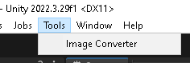

# UnityImageConverter
The script converts images to .png and .jpg formats and resizes them to dimensions that are multiples of four for compression purposes.

## Overview
- Converts images to .png and .jpg formats
- Resizes images to dimensions that are multiples of four

## Usage example
Files saved from Photoshop using Layers to File may have dimensions that are not multiples of four. This script allows you to save them in a project with compression support.

## Install
Download the zip or install via PM → Add package from git URL → `https://github.com/r-set/UnityImageConverter.git?path=/Assets/ImageConverter` → Add

## Usage

1. In Unity, open Tools → ImageConverter.

2. Select the folder from which to take the images.

3. Select the folder where to save the images.

4. Choose the image format.

5. Choose to resize to dimensions that are multiples of four.

6. Click Convert Images.

